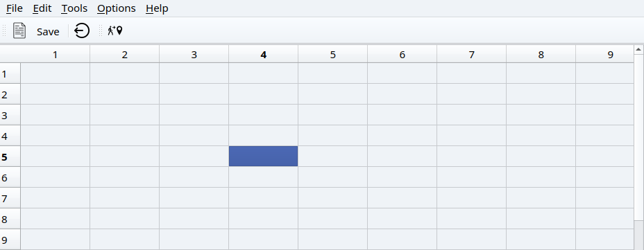
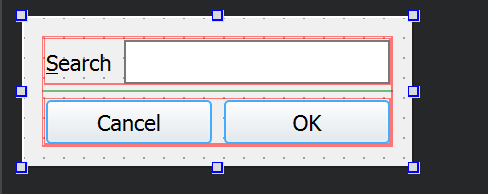
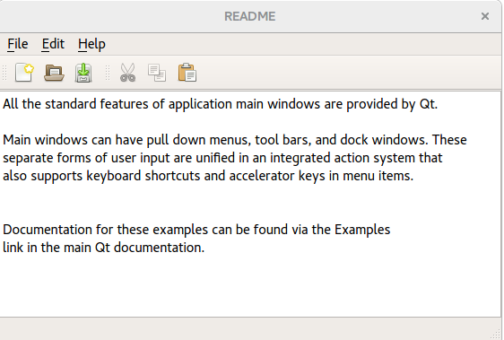
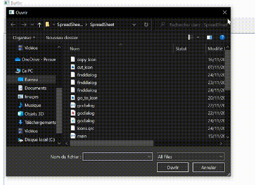

# *Application Using Main Window*
 >### Create a MainWindow based application using the designer

# **Qt GUI**
The Qt GUI module provides classes for windowing system integration, event handling, OpenGL and OpenGL ES integration, 2D graphics, basic imaging, fonts and text. These classes are used internally by Qt's user interface technologies and can also be used directly, for instance to write applications using low-level OpenGL ES graphics APIs.
Using a Qt module requires linking against the module library, either directly or through other dependencies. Several build tools have dedicated support for this, including CMake and qmake.


# **Qt Designer**
Qt Designer is the Qt tool for designing and building graphical user interfaces (GUIs) with Qt Widgets. You can compose and customize your windows or dialogs in a what-you-see-is-what-you-get (WYSIWYG) manner, and test them using different styles and resolutions.
# **Qt Main Window Framework**


*A main window provides a framework for building an application's user interface. Qt has QMainWindow and its related classes for main window management. QMainWindow has its own layout to which you can add QToolBars, QDockWidgets, a QMenuBar, and a QStatusBar. The layout has a center area that can be occupied by any kind of widget. You can see an image of the layout below.*


> **Note: Creating a main window without a central widget is not supported. You must have a central widget even if it is just a placeholder.** 


---


 We will START by creating  a spreadsheet that contains the following components:
   *  *Menu Bar*
   * *Tools Bar* 
   * *Status Bar*

 ## We should have an application that looks like this :




- ###   *So we need to add two classes that represent two functionnalities and the main class that will associet all the others* :

   - **Cell location (go to cell)**
   - **Find**


We will add the function for the goCell action. For that, we need to create a Dialog for the user to select a cell.


Than we will create the class ->*GoDialog.h* / ->*GoDialog.cpp* with a regular expression validator for the **lineEdit** and the **public-Getter** for the line edit Text to get the cell address

## **GoDialog.h**
```c++
#ifndef GODIALOG_H
#define GODIALOG_H

#include <QDialog>

namespace Ui {
class GoDialog;
}

class GoDialog : public QDialog
{
    Q_OBJECT

public:
    explicit GoDialog(QWidget *parent = nullptr);
    ~GoDialog();
 QString getText()const;
private:
    Ui::GoDialog *ui;
};

#endif // GODIALOG_H
```

> *THAN WE WIIL ADD THIS IMPLEMENTATION IN* :

## **GoDialog.cpp**

```c++
#include "godialog.h"
#include "ui_godialog.h"
#include<QRegExp>
#include<QRegExpValidator>
GoDialog::GoDialog(QWidget *parent) :
    QDialog(parent),
    ui(new Ui::GoDialog)
{

    ui->setupUi(this);
     
     QRegExp regCell{"[A-Z][1-9][0-9]{0,2}"};

     
     ui->lineEdit->setValidator(new QRegExpValidator(regCell));

}
QString GoDialog::getText()const
{
    return ui->lineEdit->text();
}

GoDialog::~GoDialog()
{


    delete ui;
}

```


We will move now for the Find dialog. This dialog prompts the user for a input and seek a cell that contains the entered text.




## **GoDialog.h**

```c++
#ifndef FINDDIALOG_H
#define FINDDIALOG_H

#include <QDialog>

namespace Ui {
class finddialog;
}

class finddialog : public QDialog
{
    Q_OBJECT

public:
    explicit finddialog(QWidget *parent = nullptr);
    ~finddialog();
     QString getText()const; 

private:
    Ui::finddialog *ui;
};

#endif // FINDDIALOG_H

```

>Implementation of The getter method in :

## **GoDialog.cpp**

```c++
#include "finddialog.h"
#include "ui_finddialog.h"
#include<QRegExp>
#include<QRegExpValidator>
finddialog::finddialog(QWidget *parent) :
    QDialog(parent),
    ui(new Ui::finddialog)
{
    ui->setupUi(this);

}
//the implementation of the getter 
QString finddialog::getText()const
{
    return ui->lineedit2->text();
}


finddialog::~finddialog()
{
    delete ui;
}

```
 

###  The **main-class**  will associed all the connexions and the slots :

# **Spreadsheet.h**

*The creating of the elements and methods :*

```c++
#ifndef SPREADSHEET_H
#define SPREADSHEET_H

#include <QMainWindow>
#include <QTableWidget>
#include <QAction>
#include <QMenu>
#include <QToolBar>
#include <QLabel>
#include <QStatusBar>

class SpreadSheet : public QMainWindow
{
    Q_OBJECT

public:
    SpreadSheet(QWidget *parent = nullptr);
    ~SpreadSheet();

protected:
    void setupMainWidget();
    void createActions();
    void createMenus();
    void createToolBars();
    void makeConnexions();
    void aboutttQt();
    void aboutt();

private slots:
    void close();
    void updateStatusBar(int, int); 
    void goCellSlot();
    void saveslot(); 
    void findCell();
    void openfile();

private:
void Save(QString filename); 
void loadcontent(QString filename);

 //Pointers
private:
    //Central Widget 
    QTableWidget *spreadsheet;

    //Actions
    QAction * newFile;
    QAction * open;
    QAction * save;
    QAction * saveAs;
    QAction * exit;
    QAction *cut;
    QAction *copy;
    QAction *paste;
    QAction *deleteAction;
    QAction *find;
    QAction *row;
    QAction *Column;
    QAction *all;
    QAction *goCell;
    QAction *recalculate;
    QAction *sort;
    QAction *showGrid;
    QAction *auto_recalculate;
    QAction *about;
    QAction *aboutQt;


    // Menus 
    QMenu *FileMenu;
    QMenu *editMenu;
    QMenu *toolsMenu;
    QMenu *optionsMenu;
    QMenu *helpMenu;


    //   Widget pour la bare d'etat
    QLabel *cellLocation;  
    QLabel *cellFormula;   
    QString * currentfile=nullptr;
};

#endif // SPREADSHEET_H

```

> The implementation wil be in :

# **Spreadsheet.cpp**

```c++
#include "spreadsheet.h"
#include <QPixmap>
#include <QMenuBar>
#include <QToolBar>
#include <QApplication>
#include <QMessageBox>
#include<godialog.h>
#include<finddialog.h>
#include <QFileDialog>
#include <QTextStream>

SpreadSheet::SpreadSheet(QWidget *parent)
    : QMainWindow(parent)
{
    
    setupMainWidget();//Seting the spreadsheet

    createActions();// Creaeting Actions

    
    createMenus();// Creating Menus

    createToolBars();//Creating the tool bar

    makeConnexions();//making the connexions


    //Creating the labels for the status bar 
    cellLocation = new QLabel("(1, 1)");
    cellFormula = new QLabel("");
    statusBar()->addPermanentWidget(cellLocation);
    statusBar()->addPermanentWidget(cellFormula);
    //initite the name of the file 
    currentfile = nullptr;
    //add the name of the file 
    setWindowTitle("Buffer");
}
//set the main widget in the center 
void SpreadSheet::setupMainWidget()
{
    spreadsheet = new QTableWidget;
    spreadsheet->setRowCount(100);
    spreadsheet->setColumnCount(10);
    setCentralWidget(spreadsheet);

}
//the desctructor 
SpreadSheet::~SpreadSheet()
{
    delete spreadsheet;

    //  Actions    
    delete  newFile;
    delete  open;
    delete  save;
    delete  saveAs;
    delete  exit;
    delete cut;
    delete copy;
    delete paste;
    delete deleteAction;
    delete find;
    delete row;
    delete Column;
    delete all;
    delete goCell;
    delete recalculate;
    delete sort;
    delete showGrid;
    delete auto_recalculate;
    delete about;
    delete aboutQt;
    // Menus 
    delete FileMenu;
    delete editMenu;
    delete toolsMenu;
    delete optionsMenu;
    delete helpMenu;
}

void SpreadSheet::createActions()
{
    // New File 
   QPixmap newIcon(":/new_file.png");
   newFile = new QAction(newIcon, "&New", this);
   newFile->setShortcut(tr("Ctrl+N"));


    //  open file 
   open = new QAction("&Open", this);
   open->setShortcut(tr("Ctrl+O"));

    //save file 
       save = new QAction("&Save", this);
   save->setShortcut(tr("Ctrl+S"));
   saveAs = new QAction("save &As", this);


    //  cut file 
   QPixmap cutIcon(":/cut_icon.png");
   cut = new QAction(newIcon, "Cu&t", this);
   cut->setShortcut(tr("Ctrl+X"));

   //  copy and paste
   copy = new QAction( "&Copy", this);
   copy->setShortcut(tr("Ctrl+C"));
   paste = new QAction( "&Paste", this);
   paste->setShortcut(tr("Ctrl+V"));

   //  delete
   deleteAction = new QAction( "&Delete", this);
   deleteAction->setShortcut(tr("Del"));

   // row/column/all 
   row  = new QAction("&Row", this);
   Column = new QAction("&Column", this);
   all = new QAction("&All", this);
   all->setShortcut(tr("Ctrl+A"));


   // --------- find-----------------
   QPixmap findIcon(":/search_icon.png");
   find= new QAction(newIcon, "&Find", this);
   find->setShortcut(tr("Ctrl+F"));
   // --------- go cell -----------------
   QPixmap goCellIcon(":/go_to_icon.png");
   goCell = new QAction( goCellIcon, "&Go to Cell", this);
   deleteAction->setShortcut(tr("f5"));

   // --------- recalculate -----------------
   recalculate = new QAction("&Recalculate",this);
   recalculate->setShortcut(tr("F9"));

   // --------- sort -----------------
   sort = new QAction("&Sort");
   // --------- show grid  -----------------
   showGrid = new QAction("&Show Grid");
   showGrid->setCheckable(true);
   showGrid->setChecked(spreadsheet->showGrid());
   // --------- auto recalculate -----------------
   auto_recalculate = new QAction("&Auto-recalculate");
   auto_recalculate->setCheckable(true);
   auto_recalculate->setChecked(true);


   // --------- about -----------------
   about =  new QAction("&About");
   // --------- about qt-----------------
   aboutQt = new QAction("About &Qt");

    // --------- exit -------------------
   QPixmap exitIcon(":/quit_icon.png");
   exit = new QAction(exitIcon,"E&xit", this);
   exit->setShortcut(tr("Ctrl+Q"));
}
//to close the window 
void SpreadSheet::close()
{

    auto reply = QMessageBox::question(this, "Exit",
                                       "Do you really want to quit?");
    if(reply == QMessageBox::Yes)
        qApp->exit();
}
//create the menus and add the elements in places
void SpreadSheet::createMenus()
{
    // --------  File menu -------//
    FileMenu = menuBar()->addMenu("&File");
    FileMenu->addAction(newFile);
    FileMenu->addAction(open);
    FileMenu->addAction(save);
    FileMenu->addAction(saveAs);
    FileMenu->addSeparator();
    FileMenu->addAction(exit);


    //------------- Edit menu --------/
    editMenu = menuBar()->addMenu("&Edit");
    editMenu->addAction(cut);
    editMenu->addAction(copy);
    editMenu->addAction(paste);
    editMenu->addAction(deleteAction);
    editMenu->addSeparator();
    auto select = editMenu->addMenu("&Select");
    select->addAction(row);
    select->addAction(Column);
    select->addAction(all);

    editMenu->addAction(find);
    editMenu->addAction(goCell);


    //-------------- Toosl menu ------------
    toolsMenu = menuBar()->addMenu("&Tools");
    toolsMenu->addAction(recalculate);
    toolsMenu->addAction(sort);


    //Optins menus
    optionsMenu = menuBar()->addMenu("&Options");
    optionsMenu->addAction(showGrid);
    optionsMenu->addAction(auto_recalculate);


    //----------- Help menu ------------
    helpMenu = menuBar()->addMenu("&Help");
    helpMenu->addAction(about);
    helpMenu->addAction(aboutQt);
}
//create the toolbars and add the elements 
void SpreadSheet::createToolBars()
{

    //Create the bunch of tools
    auto toolbar1 = addToolBar("File");


    //add the actions to the bunch 
    toolbar1->addAction(newFile);
    toolbar1->addAction(save);
    toolbar1->addSeparator();
    toolbar1->addAction(exit);


    //Create another bunch of tool
    auto toolbar2  = addToolBar("ToolS");
    toolbar2->addAction(goCell);
}
//update the status bar according to the choice
void SpreadSheet::updateStatusBar(int row, int col)
{
    QString cell{"(%0, %1)"};
   cellLocation->setText(cell.arg(row+1).arg(col+1));

}
//make the connexions 
void SpreadSheet::makeConnexions()
{

   // --------- Connexion for the  select all action ----/
   connect(all, &QAction::triggered,
           spreadsheet, &QTableWidget::selectAll);

   // Connection for the  show grid
   connect(showGrid, &QAction::triggered,
           spreadsheet, &QTableWidget::setShowGrid);

   //Connection for the exit button
   connect(exit, &QAction::triggered, this, &SpreadSheet::close);


   //connectting the chane of any element in the spreadsheet with the update status bar
   connect(spreadsheet, &QTableWidget::cellClicked, this,  &SpreadSheet::updateStatusBar);
   //Connextion between the gocell action and the gocell slot
   connect(goCell, &QAction::triggered, this, &SpreadSheet::goCellSlot);

   connect(find, &QAction::triggered, this, &SpreadSheet::findCell);

   connect(save, &QAction::triggered, this, &SpreadSheet::saveslot);
   //connect(saveAs, &QAction::triggered, this , &SpreadSheet::saveasslot);
  connect(open, &QAction::triggered, this, &SpreadSheet::openfile);
  connect(aboutQt,&QAction::triggered,this,&SpreadSheet::aboutttQt);
  connect(about,&QAction::triggered,this,&SpreadSheet::aboutt);
}
void SpreadSheet::aboutttQt(){
    QMessageBox::aboutQt(this,"Qt installation");
}
void SpreadSheet::aboutt()
{
   QMessageBox::about(this, tr("About Application"),
            tr("The <b>Application</b> example demonstrates how to "
               "write modern GUI applications using Qt, with a menu bar, "
               "toolbars, and a status bar."));
}

void SpreadSheet::openfile(){

    if(!currentfile)
      {
        QFileDialog D;
  //  auto d=   D.getExistingDirectory();
    auto file=D.getOpenFileName();
        //function that save the content 
        loadcontent(file);


}}
void SpreadSheet::loadcontent(QString filename){
    //open the pointer on the file 
    QFile file(filename);
    if(file.open(QIODevice::ReadOnly))
    {
        QTextStream in (&file);
        //run throught all the file 
        while(!in.atEnd()){
            QString line;
            line = in.readLine();
            //separate the lignes with a comma 
            auto tokens = line.split(QChar(','));
            //row
            int row= tokens[0].toInt();
            int col = tokens[1].toInt();
           auto cell= new QTableWidgetItem(tokens[2]);
           spreadsheet->setItem(row,col,cell);
        }
    }

    file.close();
}


void SpreadSheet::saveslot(){
//verifey if we have a name of the file 
if(!currentfile)
  {
    QFileDialog D;
    auto filename = D.getSaveFileName();
    //change the file name 
    currentfile= new QString(filename);
    //change the title 
    setWindowTitle(*currentfile);}
    //function that save the content 
    Save(*currentfile);

}
void SpreadSheet::Save(QString filename){
    //pointer on the file 
    QFile file(filename);
    //open the file on read mode 
    if(file.open(QIODevice::WriteOnly))
    {
        QTextStream out(&file);
        //loop that save the contents 
        for(int i=0;i<spreadsheet->rowCount();i++){
            for(int j=0; j<spreadsheet->columnCount();j++){
                auto cell= spreadsheet->item(i,j);
        if(cell){
            out << i << ","  << j << "," << cell->text() << endl;
        }}
    }}

    file.close();
}

//the slot of the cell function 
void SpreadSheet::findCell(){
    finddialog D;
auto reply= D.exec();
if(reply ==QDialog ::Accepted){

auto pattern =D.getText();
//a loop to pass throught all the cell 
for( int i= 0; i<spreadsheet->rowCount(); i++){

    for(int j=0; j < spreadsheet->columnCount(); j++){
        auto cell= spreadsheet->item(i, j);
        if(cell )
         if(cell->text().contains(pattern)){

             spreadsheet->setCurrentCell(i, j);
             return ;
         }


    }
}


}
}


void SpreadSheet::goCellSlot()
 {
     //Creating the dialog
     GoDialog D;

     //Executing the dialog and storing the user response
     auto reply = D.exec();

     //Checking if the dialog is accepted
     if(reply == GoDialog::Accepted)
     {
         //Getting the cell text
                  auto text = D.getText();

                  //letter distance
                  int row = text[0].toLatin1() - 'A';
                  text = text.remove(0,1);

                  //second coordinate
                  int col =  text.toInt()-1;

                  spreadsheet->setCurrentCell(row,col);


                  //changing the current cell
                  spreadsheet->setCurrentCell(row, col);

     }

 }

```


> # **Main class:**

```c++
#include "spreadsheet.h"

#include <QApplication>

int main(int argc, char *argv[])
{
    QApplication a(argc, argv);
    SpreadSheet w;
    w.show();//showing the result 
    return a.exec();
}

```

# **The TEST and Results**


---
---


For your first example, we will playing the Designer for a fast application creation. The application is from Qt Examples and is a simple text editor program built around QPlainText.



We create a class called texteditor :


# **Texteditor.h**


```c++
#ifndef TEXTEDITOR_H
#define TEXTEDITOR_H

#include <QMainWindow>
#include <QTableWidget>
#include <QAction>
#include <QMenu>
#include <QToolBar>
#include <QLabel>
#include <QStatusBar>
#include <QPlainTextEdit>


class texteditor : public QMainWindow
{
    Q_OBJECT

public:
    texteditor();
    ~texteditor();
protected:
    void createActions();//create the actions
    void createMenus();//create the menus
    void createToolBars();//create the toolbars
    void makeConnexions();//make the connexions between the elements
private slots:
    void close();
    void saveslot();
    void openfile();
    void documentWasModified();
    void about();
    void abouttQt();
    void saveas();
    void copyslot();
    void pasteslot();
    void cutslot();
private:
void Save(QString filename);
void loadcontent(QString filename);
void saveFile(const QString &fileName);
private:
    // --------------- Central Widget -------------//
    QTableWidget *spreadsheet;

    // --------------- Actions       --------------//
    QAction * newFile;
    QAction * open;
    QAction * save;
    QAction * saveAs;
    QAction * exit;
    QAction *cut;
    QAction *copy;
    QAction *paste;
    QAction *aboutt;
    QAction *aboutQt;


    // ---------- Menus ----------
    QMenu *FileMenu;
    QMenu *editMenu;
    QMenu *toolsMenu;
    QMenu *optionsMenu;
    QMenu *helpMenu;

    //--------------- text edit -----------------
 QPlainTextEdit *textEdit;
 //--------------- current file  -----------------
 QString * currentfile=nullptr;


};
#endif // TEXTEDITOR_H

```


# **Texteditor.cpp**

```c++
#include "texteditor.h"
#include <QPixmap>
#include <QMenuBar>
#include <QToolBar>
#include <QApplication>
#include <QMessageBox>
#include <QFileDialog>
#include <QTextStream>
texteditor::texteditor()
     : textEdit(new QPlainTextEdit)
{
    //setupMainWidget();
 setCentralWidget(textEdit);
    // Creaeting Actions
    createActions();

    // Creating Menus
    createMenus();


    //Creating the tool bar
    createToolBars();

    //making the connexions
    makeConnexions();

    //initier le nom du fichier
    currentfile = nullptr;
    //mettre le nom du spreadshet
    setWindowTitle("Buffer");

    //----------------------------------

}

texteditor::~texteditor()
{
    delete spreadsheet;

    // --------------- Actions       --------------//
    delete  newFile;
    delete  open;
    delete  save;
    delete  saveAs;
    delete  exit;
    delete cut;
    delete copy;
    delete paste;
    delete aboutt;
    delete aboutQt;


    // ---------- Menus ----------
    delete FileMenu;
    delete editMenu;
    delete toolsMenu;
    delete optionsMenu;
    delete helpMenu;
}
void texteditor::createActions(){
    // --------- New File -------------------
   QPixmap newIcon(":/new_file.png");
   newFile = new QAction(newIcon, "&New", this);
   newFile->setShortcut(tr("Ctrl+N"));


    // --------- open file -------------------
    QPixmap openIcon(":/open.png");
   open = new QAction(openIcon,"&Open", this);
   open->setShortcut(tr("Ctrl+O"));

    // --------- save file -------------------
    QPixmap saveIcon(":/save_file.png");
   save = new QAction(saveIcon,"&Save", this);
   save->setShortcut(tr("Ctrl+S"));

    // --------- save_as file -------------------
    QPixmap saveasIcon(":/save-file.png");
   saveAs = new QAction(saveasIcon,"save &As", this);


    // --------- cut file -------------------
   QPixmap cutIcon(":/cut.png");
   cut = new QAction(cutIcon, "Cu&t", this);
   cut->setShortcut(tr("Ctrl+X"));

   // --------- Copy -----------------
    QPixmap copyIcon(":/copy.png");
   copy = new QAction( copyIcon,"&Copy", this);
   copy->setShortcut(tr("Ctrl+C"));
  // ---------paste -----------------
    QPixmap pasteIcon(":/paste.png");
   paste = new QAction( pasteIcon,"&Paste", this);
   paste->setShortcut(tr("Ctrl+V"));
   // --------- about -----------------
   QPixmap aboutIcon(":/info.png");
   aboutt =  new QAction(aboutIcon,"&About",this);
   // --------- about_Qt -----------------
   QPixmap qtIcon(":/qt.png");
   aboutQt = new QAction(qtIcon,"About &Qt",this);

    // --------- exit -------------------
   QPixmap exitIcon(":/quit_icon.png");
   exit = new QAction(exitIcon,"E&xit", this);
   exit->setShortcut(tr("Ctrl+Q"));
}
// --------- to close the window -----------------
void texteditor::close()
{

    auto reply = QMessageBox::question(this, "Exit",
                                       "Do you really want to quit?");
    if(reply == QMessageBox::Yes)
        qApp->exit();
}
void texteditor::createMenus()
{
    // --------  File menu -------//
    FileMenu = menuBar()->addMenu("&File");
    FileMenu->addAction(newFile);
    FileMenu->addAction(open);
    FileMenu->addAction(save);
    FileMenu->addAction(saveAs);
    FileMenu->addSeparator();
    FileMenu->addAction(exit);


    //------------- Edit menu --------/
    editMenu = menuBar()->addMenu("&Edit");
    editMenu->addAction(cut);
    editMenu->addAction(copy);
    editMenu->addAction(paste);
    editMenu->addSeparator();

    //----------- Help menu ------------
    helpMenu = menuBar()->addMenu("&Help");
    helpMenu->addAction(aboutt);
    helpMenu->addAction(aboutQt);
}
// --------- create the toolbar and add some elements (newfile-save..) -----------------
void texteditor::createToolBars()
{

    //Crer une bare d'outils
    auto toolbar1 = addToolBar("File");


    //Ajouter des actions acette bar
    toolbar1->addAction(newFile);
    toolbar1->addAction(save);
    toolbar1->addSeparator();
    toolbar1->addAction(exit);
    toolbar1->addAction(copy);

}
void texteditor::makeConnexions(){
    //Connection for the exit button
    connect(exit, &QAction::triggered, this, &texteditor::close);
    //connect the save signal with it's slot
    connect(save, &QAction::triggered, this, &texteditor::saveslot);
    //connect theh open signal with it's slot
   connect(open, &QAction::triggered, this, &texteditor::openfile);
   //connect the textedit with the modification slot
    connect(textEdit->document(), &QTextDocument::contentsChanged,
              this, &texteditor::documentWasModified);
       //desable the copy and cut when we don't have a text
       cut->setEnabled(false);
       copy->setEnabled(false);
       //connect the copy and cut with the enable
       connect(textEdit, &QPlainTextEdit::copyAvailable, cut, &QAction::setEnabled);
       connect(textEdit, &QPlainTextEdit::copyAvailable, copy, &QAction::setEnabled);
       //connect the aboutt with it's slot
       connect(aboutt,&QAction::triggered,this,&texteditor::about);
       connect(aboutQt,&QAction::triggered,this,&texteditor::abouttQt);
       //connect the save_as with it's slot
       connect(saveAs,&QAction::triggered,this,&texteditor::saveas);
       //connect the copy with it's slot
       connect(copy,&QAction::triggered,this,&texteditor::copyslot);
        //connect the paste with it's slot
       connect(paste,&QAction::triggered,this,&texteditor::pasteslot);
        //connect the cut with it's slot
       connect(cut,&QAction::triggered,this,&texteditor::cutslot);

}
//----------- show the message about qt ------------
void texteditor::abouttQt(){
    QMessageBox::aboutQt(this,"Qt installation");
}
//----------- associet the copy function with the text ------------
void texteditor::copyslot(){
    textEdit->copy();
}
//----------- associet the paste function with the text  ------------
void texteditor::pasteslot(){
    textEdit->paste();
}
//----------- associet the cut function with the text  ------------
void texteditor::cutslot(){
    textEdit->cut();
}
//----------- add the modofication of the text with the function ismodified ------------
void texteditor::documentWasModified(){
    setWindowModified(textEdit->document()->isModified());

}
//----------- activate the save_as slot with the qfile dialog and the condition ------------
void texteditor::saveas()
    {

    QString filename= QFileDialog::getSaveFileName(this, "Save As");

    if (filename.isEmpty())
        return;

    QFile file(filename);


    //Open the file
    if (!file.open(QIODevice::WriteOnly | QIODevice::Text))
        return;

    QTextStream out(&file);
    file.close();
    }

void texteditor::openfile(){

    if(!currentfile)
      {
        QFileDialog D;
    auto file=D.getOpenFileName();
        //function that save the content of the file
        loadcontent(file);


}}
//----------- the slot that save the content of a file   ------------
void texteditor::loadcontent(QString filename){
    //open the file with the pointer
    QFile file(filename);
    if(file.open(QIODevice::ReadOnly))
    {
        QTextStream in (&file);
        //read all the content of the file
        while(!in.atEnd()){
            QString line;
            line = in.readLine();
            //separate the line with a comma
            auto tokens = line.split(QChar(','));
            //row
            int row= tokens[0].toInt();
            int col = tokens[1].toInt();
           auto cell= new QTableWidgetItem(tokens[2]);
           spreadsheet->setItem(row,col,cell);
        }
    }
//to close the file
    file.close();
}


void texteditor::saveslot(){
//verifiy if we have a name of file
if(!currentfile)
  {
    QFileDialog D;
    auto filename = D.getSaveFileName();
    //change the file name
    currentfile= new QString(filename);
    //changer le titre
    setWindowTitle(*currentfile);}
    //fonction that save the content
    Save(*currentfile);

}
//----------- the message showed by the about slot    ------------
void texteditor::about()
{
   QMessageBox::about(this, tr("About Application"),
            tr("The <b>Application</b> example demonstrates how to "
               "write modern GUI applications using Qt, with a menu bar, "
               "toolbars, and a status bar."));
}
//----------- the slot that save the content of a file   ------------
void texteditor::Save(QString filename){
    
    QFile file(filename);
    
    if(file.open(QIODevice::WriteOnly))
    {
        QTextStream out(&file);
        
        for(int i=0;i<spreadsheet->rowCount();i++){
            for(int j=0; j<spreadsheet->columnCount();j++){
                auto cell= spreadsheet->item(i,j);
        if(cell){
            out << i << ","  << j << "," << cell->text() << endl;
        }}
    }}

    file.close();
}


```

> # **Main class:**

```c++
#include "texteditor.h"

#include <QApplication>

int main(int argc, char *argv[])
{
    QApplication a(argc, argv);
    texteditor w;
    w.show();//show the result 
    return a.exec();
}

```

# **The TEST and Results**





---
---
# *->To conclude*

Qt Designer is a powerful tool when it comes to creating GUIs using Qt. One of its most straightforward and useful features is the ability to arrange your widgets in different types of layouts. Learning how to effectively create layouts with Qt Designer can sky rocket your productivity, particularly when creating complex GUIs.


---
